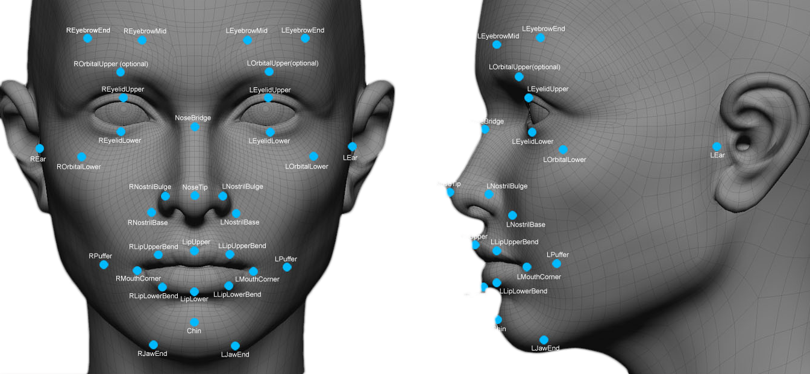
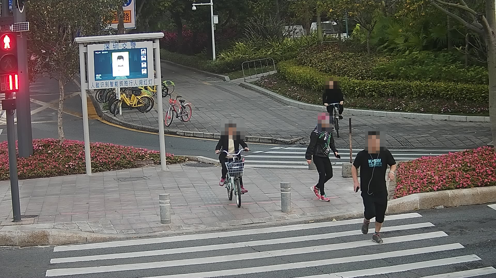

```{r setup, include=FALSE}
knitr::opts_chunk$set(echo = FALSE)
```

## How does Facial Recognition Software(FRS) work?

1. Your face is captured in a photo or on video
2. FRS reads the geometry of your face - 68 different facial features
3. FRS matches your face to a stored image or determines something about you

FRS learns to do this though machine learning and being fed data sets of images

```{r, fig.align='center'}

```

## What are the uses of FRS?

* Security - police, airports
* Authentication - unlocking mobile phones
* Social media - Facebook photo tagging, animoji
* Marketing - smart billboards, targeted advertising
* State control -  tracking the Uighur population in China, social credit scores

[Microsoft Azure demo](https://azure.microsoft.com/en-us/resources/videos/face-identification-demo-1/)

What happens when FRS gets it wrong? 

## Problems with Bias and Accuracy

```{r, out.width= "400px", fig.align='center'}
knitr::include_graphics("images/wgl05.19-joy-buolamwini.jpg")
```

* Joy Buolamwini used a FRS in her project which did not recognize her - only worked when she wore a white mask
* She then ran a study to evaluate how well FRS does at identifying gender in people with different skin colours
* Error rate was 0.8% for white men - 20-35% for black women
* This is due to the data sets fed into the FRS - largely white and male faces

## Problems with Privacy

* Loss of anonymity - government can track you anywhere e.g Chinese jaywalkers
* Police have tracked and arrested protesters using FRS
* No legislation to make police in the USA remove your image from their database
* Image databases are vulnerable to hackers
* What can be done with your image?

```{r, out.width="400px", fig.align='center'}

```

## Regulation - Legislation

* GDPR - covers biometric data as a "special category" and specifically mentions "facial images"
* This means you have to have explicit consent or a really good reason to use it
* Biometric Information Privacy Act (Illinois) - less restrictive then GDPR
* Users must be transparent in how they are using FRS - but doesn't apply to the police
* FRS banned entirely in San Francisco and Oakland

[Ban Facial Recognition Map](https://www.banfacialrecognition.com/map/)

## Improving the Datasets

* Self reporting - Face Recognition Vendor Test

```{r, out.width="500px", out.height="300px", fig.align='center'}

```

* Algorithmic Justice League - Safe Face Pledge
* Best practices - transparency, testing for fairness and accuracy, asking for consent
* Or maybe take [a more personal approach...](https://cvdazzle.com/)

## Conclusion

Facial Recognition Software should be regulated - but how? 

The datasets used to train FRS need to be more inclusive and representative of the population

Legislation ensuring self-reporting of bias and errors for all developers and sellers of FRS

BIPA seems like a good compromise to address privacy issues while allowing wider use
